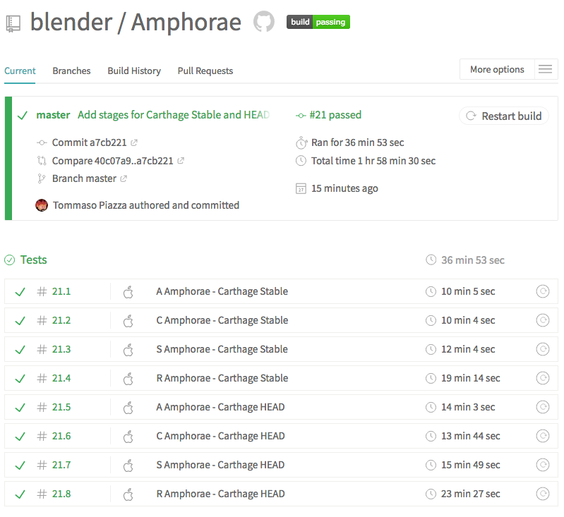

# Amphorae [](https://travis-ci.org/blender/Amphorae)

Carthage compatibility tests

From Wikipedia: 
> An amphora is a type of container of a characteristic shape and size.

## What is an Amphora

An Amphora is simply a [bats test](https://github.com/bats-core/bats-core) that invokes [Carthage](https://github.com/Carthage/Carthage/) and checks the results of the invocation.

- If the Amphora succedes, the project is compabitle with carthage. 
- If the Amphora fails:
  - either the project is not compatible with Carthage 
  - or Carthage is not compatible with the project
  
Either way, a failure is not a good sign.
  
## Amphorae organization

Amphorae are organized alphabetically in different folders.

Don't over populate a folder for the sake of parallelizing [Travis](https://travis-ci.org/blender/Amphorae) job stages. No more than 10 Amphorae in one folder.

To have [Travis run Amphorae](https://travis-ci.org/blender/Amphorae) for new folder `XYZ` add a two stages to the [.travis.yml](https://github.com/blender/Amphorae/blob/master/.travis.yml) like so:

- HEAD Stage
```yaml
    - stage: "Tests"
      install:
        - brew update
        - brew install bats-core 
        - brew uninstall carthage
        - brew install carthage --HEAD
      script: travis_wait 30 bats Amphorae/XYZ/*
      name: "XYZ Amphorae - Carthage HEAD"
```

- Stable Stage
```yaml
    - stage: "Tests"
      install:
        - brew update
        - brew install bats-core 
      script: travis_wait 30 bats Amphorae/XYZ/*
      name: "XYZ Amphorae - Carthage Stable"
```
  
## Amphora template

An Amphora template looks like the following

```bash
#!/usr/bin/env bats

setup() {

    export PROJECT_NAME=AFNetworking
    cd $BATS_TMPDIR
    rm -rf carthage_${PROJECT_NAME}
    mkdir carthage_${PROJECT_NAME} && cd carthage_${PROJECT_NAME}
    printf 'github "%s/%s" ~> 3.2.1' "${PROJECT_NAME}" "${PROJECT_NAME}" > Cartfile

    echo $BATS_TMPDIR

}

teardown() {

    cd $BATS_TEST_DIRNAME
    rm -rf carthage_${PROJECT_NAME}
}

@test "Carthage builds AFNetworking" {

    run carthage update --no-use-binaries --cache-builds

    [ "$status" -eq 0 ]

    # Version file
    [ -e "Carthage/Build/.${PROJECT_NAME}.version" ]

    # Mac
    [ -d "Carthage/Build/Mac/${PROJECT_NAME}.framework" ]
    [ -d "Carthage/Build/Mac/${PROJECT_NAME}.framework.dSYM" ]

    # iOS
    [ -d "Carthage/Build/iOS/${PROJECT_NAME}.framework" ]
    [ -d "Carthage/Build/iOS/${PROJECT_NAME}.framework.dSYM" ]

    symbolmapsCount=$(ls -lR Carthage/Build/iOS/*.bcsymbolmap | wc -l)
    [ "$symbolmapsCount" -eq 2 ]

    # tvOS
    [ -d "Carthage/Build/tvOS/${PROJECT_NAME}.framework" ]
    [ -d "Carthage/Build/tvOS/${PROJECT_NAME}.framework.dSYM" ]

    symbolmapsCount=$(ls -lR Carthage/Build/tvOS/*.bcsymbolmap | wc -l)
    [ "$symbolmapsCount" -eq 1 ]

    # watchOS
    [ -d "Carthage/Build/watchOS/${PROJECT_NAME}.framework" ]
    [ -d "Carthage/Build/watchOS/${PROJECT_NAME}.framework.dSYM" ]

    symbolmapsCount=$(ls -lR Carthage/Build/watchOS/*.bcsymbolmap | wc -l)
    [ "$symbolmapsCount" -eq 1 ]
}
```

Not all projects are the same so customisation is required here and there.

## Travis screenshots

